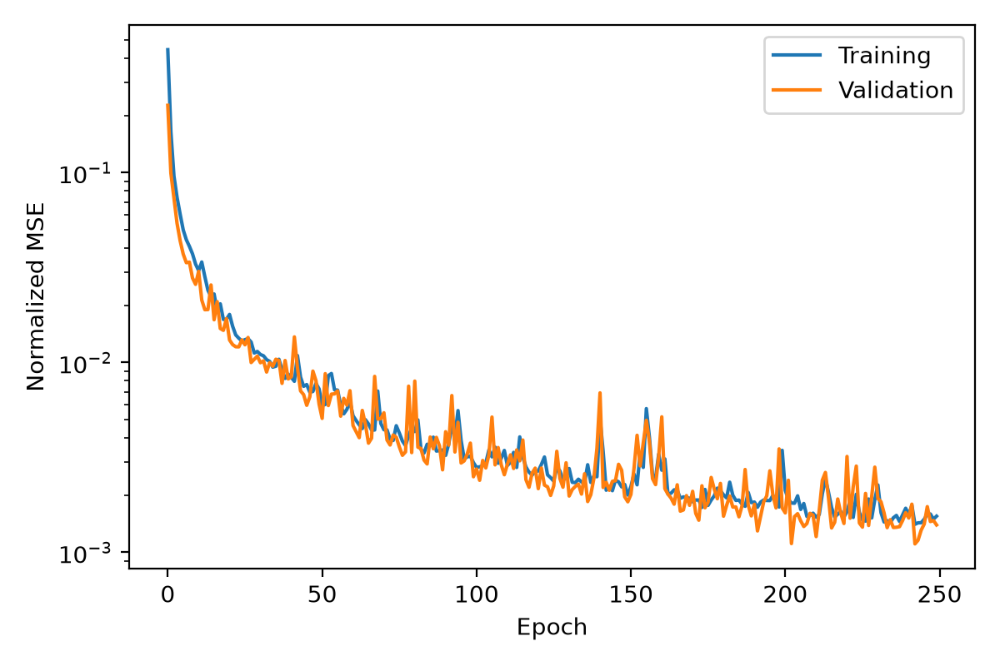
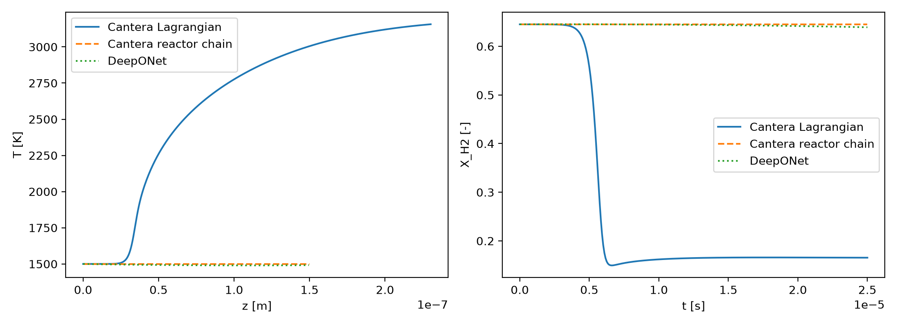

<!-- minimum 14 pt arial font size -->

<!-- _class: lead -->

# ChemOperator

## Reusable simulation datasets for neural operators

**Rohan Patel**  
CISTAR
7/14/26

---

# Motivation: the simulation bottleneck

<div class="columns">
<div>

### Before training

- Explore operating conditions
- Vary initial and boundary conditions
- Solve stiff reacting systems
- Repeat across geometries and mechanisms

</div>
<div>

### During model development

- Regenerate missing cases
- Reconcile arrays and units
- Rebuild dataset splits
- Recover solver settings and provenance

</div>
</div>

<p class="note">Fast surrogates require consistent, traceable simulation data.</p>

---

# Motivation: why operator learning?

<div class="columns">
<div>

### Advantages

- Fast predictions after training
- Learns maps between functions
- Useful for design, control, and uncertainty studies
- Can combine multiple model fidelities

</div>
<div>

### Limitations

- High-fidelity data are expensive
- Unseen conditions and long horizons are difficult
- Grid restrictions depend on the architecture
- Uncertainty and scalability remain open problems

</div>
</div>

<!-- <p class="source">s</p> -->

---

# Project goal

Build one workflow that can:

1. **Generate** families of reactor simulations
2. **Store** them in a common data structure
3. **Load** them directly for machine learning
4. **Compare** learned operators with numerical solvers

<p class="note">The solver changes. The dataset interface does not.</p>

---

# Software workflow


<p class="caption"><code>CaseSimulator</code> → <code>SimulationRecord</code> → HDF5 → <code>CanteraDataset</code></p>

---

# Simulation record

<div class="columns wide-right">
<div>

- **Coordinates:** $t$, $z$, $r$
- **Fields:** $T$, $P$, composition, velocity
- **Constants:** geometry and controls
- **Metadata:** mechanism, solver, seed, wall time

</div>
<div>

```python
SimulationRecord(
    coordinates={"t": states.t},
    fields={"T": states.T,
            "P": states.P,
            "X": states.X},
    constants=geometry | controls,
    metadata={"mechanism": mechanism,
              "solver_parameters": settings},
)
```

</div>
</div>

---

# Dataset generation

1. Define constant, grid, or sampled parameters
2. Create independent training, validation, and test splits
3. Construct and run each reactor case
4. Attach parameters and provenance
5. Save structured HDF5 records

```text
reactor_train.h5
reactor_valid.h5
reactor_test.h5
└── cases/000000/{coordinates, fields, constants, metadata}
```

---

# Reactor examples

| Example | Model | Coordinates |
|---|---|---|
| **CSTR** | Transient reactor network; ODE | $t$ |
| **PFR** | Lagrangian particle or reactor chain | $t, z$ |
| **1-D packed bed** | Gas, surface, momentum, energy, membrane; DAE | $z$ |
| **2-D catalytic membrane** | Axial-radial reacting flow | $z, r$ |

The examples span different solvers, physics, and array shapes.

---

# Quasi-2-D catalytic membrane reactor


- Spatial fields include temperature, velocity, methane, and hydrogen.
- The external solver is wrapped behind the same dataset interface.

<p class="caption">Methane reforming case with 10 radial cells.</p>

---

# Quasi-2-D axial profiles

<div class="columns wide-right">
<div>

- Multiple radial locations share one record.
- Axial and radial structure is retained.
- The data can support field-to-field operator models.

</div>
<div>


</div>
</div>

---

# Machine-learning interface

<div class="columns">
<div>

### Full trajectory

Initial state and parameters → complete time or spatial history

</div>
<div>

### Windowed forecast

Past states and coordinates → future states

</div>
</div>

`CanteraDataset` provides:

- PyTorch tensors
- Lazy HDF5 access
- Named inputs and outputs
- Configurable stride and prediction horizon

---

# Preliminary DeepONet benchmark

<div class="columns wide-right">
<div>



<p class="caption">Normalized mean squared error</p>

</div>
<div>



<p class="caption">Held-out PFR comparison</p>

</div>
</div>

---

# Preliminary result

The loss decreases, but the learned model does not reproduce the reference ignition behavior.

This exposes three needs:

- Audit the prediction task and target construction
- Evaluate physical quantities, not only normalized loss
- Add conservation and ignition-aware metrics

<p class="note"><strong>Low training loss does not guarantee physical accuracy.</strong></p>

---

# Current outcome

- One record format supports four reactor families.
- Every case retains parameters and solver provenance.
- HDF5 records load directly into PyTorch.
- Numerical solvers remain the benchmark reference.

<div class="placeholder">
Add final case counts, generation times, surrogate errors, and inference speedups.
</div>

---

# Next steps

- Complete benchmarks for all reactors
- Fit normalization using training data only
- Add physics-based evaluation metrics
- Expand regression tests
- Support resumable dataset generation
- Explore richer geometries and quantum neural-network layers

---

<!-- _class: lead -->

# Takeaway

ChemOperator turns reactor simulations into reusable machine-learning datasets.

**Generate once. Preserve the physics. Benchmark many models.**

Questions?